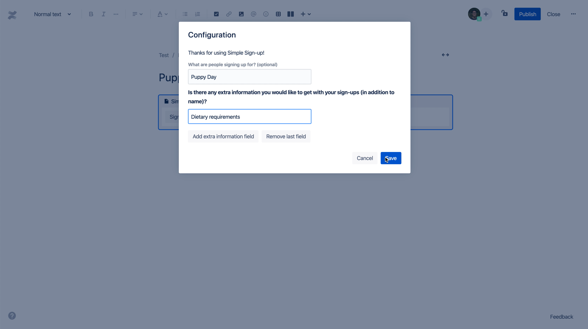
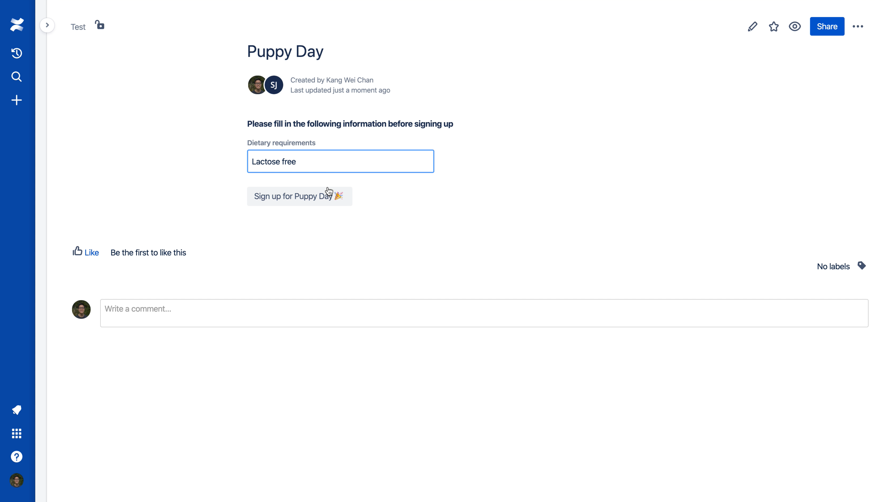
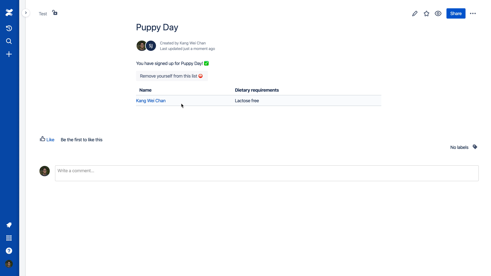

# Forge Simple Sign-up Macro

This Forge app adds an easy-to-use sign-up form to your Confluence Cloud page or blog.

## Requirements

See [Set up Forge](https://developer.atlassian.com/platform/forge/set-up-forge/) for instructions to get set up.

## Quick start

Once you have logged into the CLI (`forge login`), follow the steps below to install the app onto your site:

1. Clone this repository
2. Run `forge register` to register a new copy of this app to your developer account
3. Run `npm install` to install your dependencies
4. Run `forge deploy` to deploy the app into the default environment
5. Run `forge install` and follow the prompts to install the app

## Configuration view

## Sign-up view

## Display view

## Code

The app code can be found in [src/index.tsx](./src/index.tsx).

The **Simple Sign-up** macro should now appear in your macro browser.

At this point, you now have your own copy of a Forge app.
